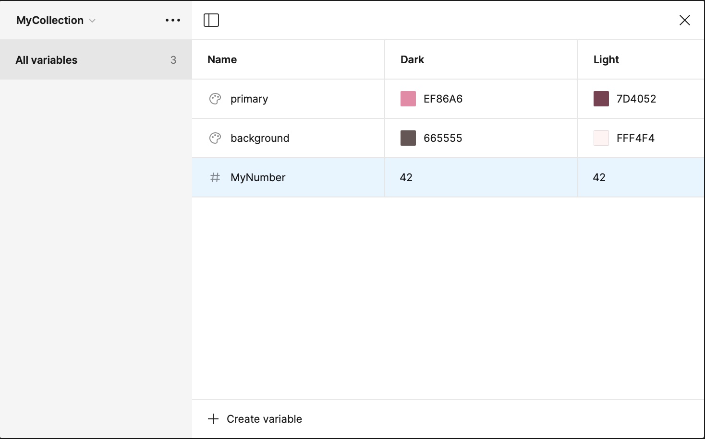

# 🧙‍♂️ Figmage 🧙
A CLI tool for generating Figma styles for Flutter

[![Empowered by whynotmake.it][wnmi_badge]](https://whynotmake.it)

[](https://github.com/felangel/mason)
[](https://github.com/invertase/melos)


## Documentation 📝
Figmage comes with a comprehensive documentation, which you can find [here](https://figmage.netlify.app/)

If this is your first time here, check out our [Getting Started Guide](https://figmage.netlify.app/guides/getting-started/)!

## What's in the box 🎁
Figmage is a magical CLI tool that helps you generate a flutter package from your Figma Design System. It uses the Figma APIs to fetch your design tokens from published **styles**, as well as **variables**, with full **modes** support.

So a variables section like this:


Is only a short `figmage forge` run away from becoming code like this:

```dart
// colors.dart
import 'package:flutter/material.dart';
@immutable
class ColorsMyCollection extends ThemeExtension<ColorsMyCollection> {
  const ColorsMyCollection({
    required this.background,
    required this.primary,
  });

  const ColorsMyCollection.dark()
      : background = const Color(0xff665555),
        primary = const Color(0xffef86a6);

  const ColorsMyCollection.light()
      : background = const Color(0xfffff4f4),
        primary = const Color(0xff7d4052);

  final Color background;

  final Color primary;

  @override
  ColorsMyCollection copyWith([
    Color? background,
    Color? primary,
  ]) {
    /// ...
  }

  @override
  ColorsMyCollection lerp(
    ColorsMyCollection other,
    double t,
  ) {
    /// ...
  } 
}

extension ColorsMyCollectionBuildContextX on BuildContext {
  ColorsMyCollection get colorsMyCollection =>
      Theme.of(this).extension<ColorsMyCollection>()!;
}
```

And you can use it like this:

```dart
  @override
  Widget build(BuildContext context, WidgetRef ref) {
    final colors = context.colorsDesignSystem;
    final typography = context.typographyDesignSystem;

    return Container(
        color: colors.primary,
        child: Text('Hello world!', style: typography.body1),
    )
    // ...
```

### Features
- ✨ Generate a Flutter package from your Figma Design System
- 🎨 Supports many types of tokens:
  - 🌈 **Color** styles and variables
  - 🖋️ **Typography** styles (with optional `google_fonts` support!)
  - 🔢 **Number** variables, which can be generated as Paddings, and Spacers as well
- 🌓 **Modes** support for variables: Generate different tokens for different themes (e.g. dark/light)
- 📦 **Package** generation: All your tokens end up in one convenient package. Depend on it from your app, and update it whenever neccessary!
- 🤝 **Seamless** integration with `Theme`s from `material.dart`: Generated classes are `ThemeExtension`s, so they can be integrated into your app's theme easily!
- 🎯 **Quick access** using `BuildContext` extensions.
- 🔮 **Portable**: figmage is a pure dart package, so it can easily be integrated into your CI/CD pipelines, to automatically fetch the latest tokens of your project for you!


[dart_install_link]: https://dart.dev/get-dart
[github_actions_link]: https://docs.github.com/en/actions/learn-github-actions
[license_badge]: https://img.shields.io/badge/license-MIT-blue.svg
[license_link]: https://opensource.org/licenses/MIT
[mason_link]: https://github.com/felangel/mason
[very_good_ventures_link]: https://verygood.ventures
[wnmi_badge]:
  https://img.shields.io/badge/empowered_by-whynotmake.it-black?logo=data%3Aimage%2Fpng%3Bbase64%2CiVBORw0KGgoAAAANSUhEUgAAAJYAAACWCAYAAAA8AXHiAAAACXBIWXMAAAsTAAALEwEAmpwYAAAAAXNSR0IArs4c6QAAAARnQU1BAACxjwv8YQUAAAe2SURBVHgB7Z2BlaM2EIbHqWBLoITtIE4HlwpMKthNBSYV5DpYXwWXVOB0cNcB6WC3g4l44Lw5kECCEUjwf%2B%2Fx%2FNaGGYG%2BNQLGQAQAAAAAAAAAAAAAAAAAAAAAAAAAAAAAAAAAAAAAAHAgTpQgzHw2L0X35%2FfT6fSdVsDkfTIvL2Y6m%2BnZTM3fH00bzPTFtONGID9Mx76Y6Z2H1GYqKCIm%2FidH7lXbAZQxHXblaS4UAc%2FcDxr5ngmkT2DHqsoVmBty5YKjY5uOezPTV44oF7ulqrgdbzXzPJvpBrkyYkSqZzFPyRHkGpGqdMxfTbUVJICPVGJeVblCpRLLQa6UCZFKLKMi11ypxPKQK0XmSCWWXSTXUqlEHMiVEkukEjFmyaUllYgHuVJAQyoRK0gubalEXJdcTwTioymViOklVyypRHybXBWBuMSQSsR2yfWp%2B%2FwlplSiHZ978b8RiEdMqUSO0pVjDam6NhSW%2FG8xch2esQ4nZUZyRZdqJP%2BDmjGg16PboNGlEvkqHueVIsDtt1U9kRtHixqYjXi2bNyoG9aRU1KQMp5SHVKunygORe%2Fvv1co1vt54vOSFOlEvdNwXW9m%2BtVMX3rvN6cg7keSSx0ejjnuFBH2L33RqopwfVNVvflwElUTth%2BRrV2kd%2BcIcvlKJeaHXJo4OnatIr2y%2BzzoDL1HviCpxHKQSwt2D6ZjF%2BmVvfm0qiJmSSWWh1xaMCdTpLe0KmKRVCIO5NKC0ynSm1sVoSKViAe5tOB0ivRCqyJUpRJxXXIVBMLgdIr0fKsiokgl4tvk%2BkwgHOZkivRc7XjtPj%2FHlEq0oy%2FXO4F5MCdTpOdqh4uKImDLw%2B0tBkAozMkU6fnKVVEEeFhuI6kZA%2FpwRjr1yu2u6E%2BOKJVHOx68UQRM3CczfZvIjaPFOXD47qikCEy040zKeEoFuZbA%2FnKVFJGRdlSkyIhUzXvN%2BOrGkEsHbm8hVPNGUol2qJxvG4k%2FJtWTmA8nUbXglcZUHu2IdRnKSyoxP%2BRaCkc%2B%2BpvRHu3LUEFSieUg11xSk0q0S%2Bsy1CypxPKQK5RUpXqwVK6lUok4kMuX1KV6MFcuLalEPMg1RS5SPeDwy1CqUom4qIpwkZtUD9j%2FMlQUqUR8m1xRf6ySPOy%2BNlZSBvB0VURUqUQ7BlURmvGzw7HRS8qIEblc94hXlUq0o%2B7lufARx1ts%2F0lYSRnC0z%2FnjypV14YxkQs6CmZlX3sb4C%2FKFG53eVNPsYgp1XUi93GOFnl4D6koN%2BlYCx6vTthSqiTkinXvBhv9Df1BK8BtbVdzkbugdWjuUfHL6XRSX79GKvNS9d5u8tzM1N8DHONeETwsBykpMvzjQLvWkovdR7drf1PVcp34iCdRNxLrPtYRM2M%2Bsb3EZ1OpxLzHkmsjsSrfDvGMt8p5ql7Oa%2Bg6HEquLcRy5J3sGEecLKQSyx5Drq3EcuT27qBu%2BaykEjH2L9eWYjnye3VUrlKJWPu%2BcL21WI42jHZY7lKJmPu9cJ2CWI52WDuO21MK2UslYtvkyv%2FCNQ8P%2FUvaCIdc3LXxrXt934tUIsc9lT5QoeusPmfakBG5XGQtVZenf1mtolxxSFVTAgTIlb1UXa5qF2K5pOKEjkg85Kr3IFWX797L9YlyY%2B2NtoQJuc4UgQ2kerHkKygn2H6RNtpG02BErpKU2UCqiyVffqcbeLgLjLbRNGGlyz8TOa6xc%2FTyXdhOQbnBw%2FM%2FJWVCTLkSkirPIkvLimR1Ii6GXAlJVVGu9NeEMkRTLkilBA8L4c6UIRpyQSpFLB2S7QXPJXJBKmXY%2FoCmKDeJXYM5ckGqSLD9sXKHkAtSRYTdjwzZtVyQagUOJtdXtn9LQ6oYHEguhlQrc1C5aki1AgeUK8plE0hl4WByqYs1IhVuF3kguWrWrYq48DQqT9DIFsgVHPvC%2FkAuhlw%2BMS8OgZrSpDvksgC5JmNdHOJUYp5XyGUBcjljXHhCKjFvCbksQK7Bshf2lEosA7lsQK7%2Fl7lwoFRiWZtcOBVxdLlY4eSnQ67PdHSOKpeGVCJWf0D%2FTuBwclXsfrpsRTPh4U1NCgKHr4pYJFWXq4ZYDvYmF%2Fs90WKxVF2uGmKNsEO5pr61KlIAYnmwJ7kmxKpICYjlyV7kcqyDqlSOPAUBO7nLxfZbCTWo%2F%2B4SYgWSq1w8XvryjZSBWDPITS7eoEgPYs0kF7l4vJw4mlwQawGpyzUiVcX2RxmryQWxFpKqXOxXpFfGkgtiKZCaXJxAkR4Pd7X5P4ViC1KQi9tLNldfqcRyLrlm%2FYTM0oaaVuZEO4Lbr%2FvmnFDR%2B%2Bh2Op1%2BowC6%2F%2FCrmULuhV443v%2FD5K9oPF9pXmz%2FBB8U9vzsJxo%2Bfzt4%2FUEPjW%2BukRhzqALylqxPzRhf6cAL5GI9qZoxTvCTH7iVy6cCwoea9%2F4U%2B7XhGXKxjlQ1t6cTZg%2BWu3bceL5g70vbsJRdjbH68MiYy0y%2Fm3HHh8e8X8xUkQcm3r%2BkTCdHiCAfcr1AJNj9LdS899b9Z98d%2F%2Fk3AsAFz9vF3QiAKQLlws%2BlQBjdrs8lWHOjjfye4Zcgux68j8Ht0zKaQ%2FFmYNwMdr%2BbQe8%2FBAAAAAAAAAAAAAAAAAAAAAAAAAAAAAAAAAAAAAAAAAAASfAfQWaAgS7EyI8AAAAASUVORK5CYII%3D