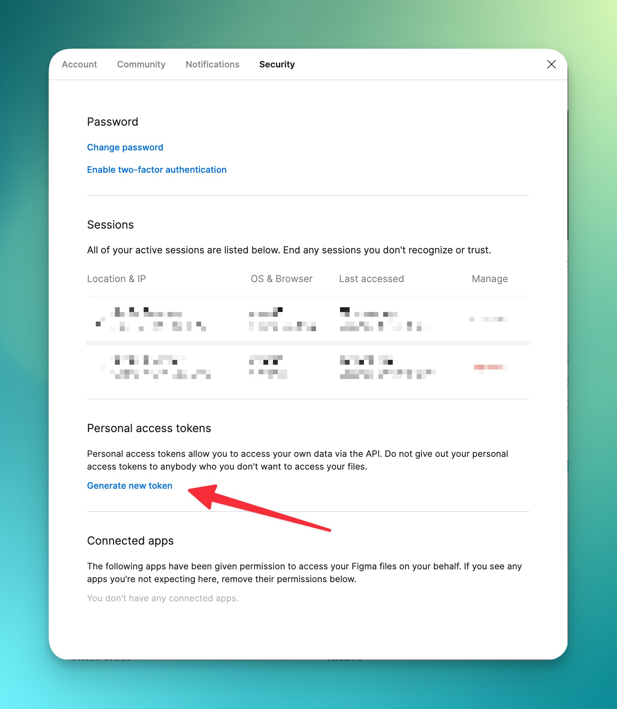

import { Steps, Card, CardGrid, Aside, LinkCard } from '@astrojs/starlight/components';

This guide will help you obtain the necessary Figma credentials to use with Figmage.

## What you need

Before you start, we assume that you have a few things ready.

<CardGrid>
<Card title="Figma Design File" icon="document" >
You should have a Figma file that represents your Design System, or just a simple app design. 
In both cases, you should have at least a few Tokens defined in your file.
</Card>
<Card title="Figma Account" icon="laptop" >
In most cases, you will only need an account that can access the file you want to sync with your project.
However, if you are using Variables in Figma, you might need a paid plan. 
Find out more [here](/reference/account-requirements).
</Card>
</CardGrid>


## Getting Your Figma File ID

<Steps>
1. Open your design file in Figma.

2. Look at the URL in your browser's address bar. It will look something like:
   ```
   https://www.figma.com/file/abcdef123456/Your-Design-File-Name
   ```

3. The part after `/file/` and before the next slash is your file ID:
   ```
   abcdef123456
   ```

4. Alternatively, click the "Share" button in the top right corner of Figma and then "Copy link." The file ID will be in the copied URL.
</Steps>

## Generating a Figma Personal Access Token


<Steps>
1. Log in to your Figma account.

2. Navigate to your account settings by clicking on your profile picture in the top-right corner and selecting "Settings."

3. Navigate to the "Security" tab and click on "Generate new token."
   

4. Give your token a name (e.g., "Figmage Integration"), as well as an expiration date.

5. Make sure your token has the following permissions:
   - **Library content**: Read only
   - **File content**: Read only

   If you are only planning to use the [`stylesFromLibrary`](/reference/configuration-options#stylesfromlibrary) 
   option, you can omit the **File content** permission.

   This is more secure, but it requires a paid Figma plan and you will need to publish your File's library every time you want Figmage to update the tokens.

6. Click "Generate token."

7. **Important**: Copy your token immediately and store it securely. Figma will only show it once.

</Steps>

:::danger[Never commit tokens to version control]
Your token will have full access to your Figma file's library. 
Depending on your choice in step 5, it will also have access to the file's contents. 

Make sure to store it securely and scope its permissions tightly.
:::

## What's Next?

You are now ready to use Figmage to generate your tokens.

<LinkCard 
    title='📦 Generate a package' 
    description='Learn how to generate a standalone package from your Figma file.'
    href="/guides/getting-started"
/>

<LinkCard 
    title='📱 Add tokens to your app' 
    description='Learn how to add tokens to your Flutter app.'
    href="/guides/add-to-app"
/>
